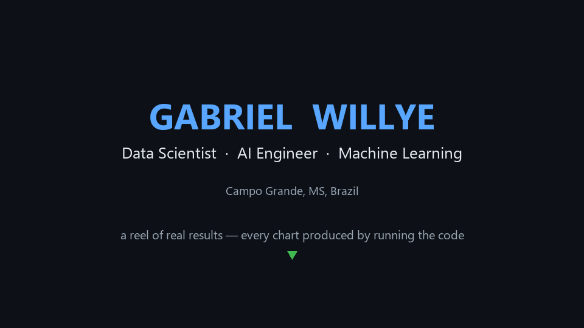

 

## 👋 About

**Data Scientist & AI Engineer** from Campo Grande, Brazil, with ~2 years building ML and data products end-to-end — from an LLM fiscal-audit agent over **180M+ records** to fraud scoring and BI that moved real numbers. I ship the demo, not just the notebook. BSc Information Systems @ UFMS · 🇧🇷 PT (native) · 🇬🇧 EN.

## 🎬 Live demos &nbsp;·&nbsp; *click and play*

| Demo | What | Stack |
|---|---|---|
| **[▶ Analytics dashboard](https://gwillye.github.io/compass/)** | Interactive Plotly dashboard from an AWS pipeline project | PySpark · AWS · Plotly |
| **[▶ Movie catalog](https://gwillye.github.io/filmow/)** | Filmow-style app on the TMDB API | JS · TMDB |
| **[▶ Doceria storefront](https://gwillye.github.io/doceria/)** | React storefront with cart | React · Vite |

## ⭐ Featured projects

| Project | Highlight | Stack |
|---|---|---|
| **[Julgador](https://github.com/gwillye/Julgador)** | Gov tax-fraud **LLM audit agent** — 180M+ records, **84%** | Gemma 2 27B · RAG · TF |
| **[Perfil_Laranja](https://github.com/gwillye/Perfil_Laranja)** | Fraud **asset-risk score** with no banking data — **82%** | HDBSCAN · Random Forest |
| **[multi-agent-system](https://github.com/DATA-UFMS/multi-agent-system)** *(TCC)* | Async **orchestrator–worker** AI that diagnoses a site's SEO/ads | Python · asyncio · RAG |
| **[face_recognition_organizer](https://github.com/gwillye/face_recognition_organizer)** | 100% offline — **~8,886 faces → ~61 people** | InsightFace · clustering |
| **[Demos_Repo](https://github.com/gwillye/Demos_Repo)** | 20+ runnable DS/ML/NLP demos, each with metrics | scikit-learn · numpy |

📂 More projects

 

**AI / ML** — [ncm_classifier](https://github.com/gwillye/ncm_classifier) · [CNN_MNIST](https://github.com/gwillye/CNN_MNIST) · [regressao_abalone](https://github.com/gwillye/regressao_abalone) · [ocr_translation_pipeline](https://github.com/gwillye/ocr_translation_pipeline) · [voice_id](https://github.com/gwillye/voice_id) · [BERT_Token_Classification](https://github.com/gwillye/BERT_Token_Classification)

**Data / BI** — [social_scraper](https://github.com/gwillye/social_scraper) · [DataAnalytics_CompassUOL](https://github.com/gwillye/DataAnalytics_CompassUOL) · [stock_data_analysis](https://github.com/gwillye/stock_data_analysis) · [Web_Scraper_YouTube](https://github.com/gwillye/Web_Scraper_YouTube)

**Web / Apps** — [filmow_desktop](https://github.com/gwillye/filmow_desktop) · [Alexandria](https://github.com/gwillye/Alexandria) · [UFMS_studies](https://github.com/gwillye/UFMS_studies)

**More analytics** — [Kaggle_Analytics](https://github.com/gwillye/Kaggle_Analytics) · [youtube_watch_history_analyzer](https://github.com/gwillye/youtube_watch_history_analyzer) · [pet_social_networks](https://github.com/gwillye/pet_social_networks)

## 💼 Experience

| Role | Impact |
|---|---|
| **Data Scientist — Government / tax** | LLM fiscal-audit agent (RAG + TensorFlow), **180M+ records · 84%** |
| **Data Scientist — Finance** | Asset-risk / fraud score (HDBSCAN + Random Forest) — **82%** |
| **BI — Digital marketing** | Python BI/ETL → **−25% diagnosis time · +R$2M in contracts** |
| **Business Analyst — Analytics** *(current)* | Analytics & decision-support, consulting |

## 🧰 Tech

## 📊 GitHub

